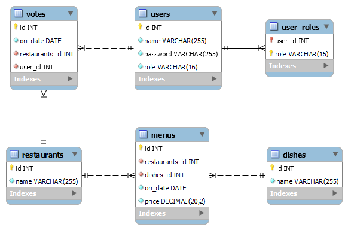

[](https://www.codacy.com/gh/savadevel/WhereToHaveLunch/dashboard?utm_source=github.com&amp;utm_medium=referral&amp;utm_content=savadevel/WhereToHaveLunch&amp;utm_campaign=Badge_Grade)

# Design and implement a REST API using Hibernate/Spring/SpringMVC (or Spring-Boot) without frontend.

The task is:

Build a voting system for deciding where to have lunch.

2 types of users: admin and regular users Admin can input a restaurant and it's lunch menu of the day (2-5 items
usually, just a dish name and price)
Menu changes each day (admins do the updates)
Users can vote on which restaurant they want to have lunch at Only one vote counted per user. If user votes again the
same day: if it's before 11:00 we assume that he changed his mind, if it's after 11:00 then it is too late, vote can't be
changed. Each restaurant provides a new menu each day.

Diagram of entities / tables:



## Swagger REST Api Documentation
Documentation available by URL (after setup WTHL):
```http request
/swagger-ui.html
```

## Using cURL for manage system for deciding where to have lunch by REST queries

| URL                                                                        | Method | Role  | Description                                                          |
| ---                                                                        |---     |---    | ---                                                                  |
| [/rest/vote-results](#Display-amount-votes-on-restaurants-on-current-date) | GET    | USER  | displays amount votes for restaurants on current date                |
| [/rest/menus](#Displays-menus-of-restaurants-on-current-date)              | GET    | ALL   | displays menus of restaurants on current date                        |
| [/rest/menus/{menu-id}](#Get-menu-by-id)                                   | GET    | ADMIN | get menu by id                                                       |
| [/rest/menus](#Add-dish-to-the-menu-of-the-restaurant-on-current-date)     | POST   | ADMIN | add dish to the menu of the restaurant on current date               |
| [/rest/menus/{menu-id}](#Delete-menu-by-id)                                | DELETE | ADMIN | delete menu by id                                                    |
| [/rest/votes](#Displays-vote-of-the-user-on-current-date)                  | GET    | USER  | displays vote of the user on current date                            |
| [/rest/votes/{vote-id}](#Get-vote-by-id)                                   | GET    | USER  | get vote by id                                                       |
| [/rest/votes](#Add-only-one-vote-for-the-restaurant-on-current-date)       | POST   | USER  | add only one vote for the restaurant on current date                 |
| [/rest/votes/{vote-id}](#Change-vote-for-the-restaurant-on-current-date)   | PATCH  | USER  | change vote for the restaurant on current date, if it's before 11:00 |
| [/rest/restaurants](#Displays-dictionary-of-restaurants)                   | GET    | ADMIN | displays dictionary of restaurants                                   |
| [/rest/restaurants/{restaurant-id}](#Get-restaurant-by-id)                 | GET    | ADMIN | get restaurant by id                                                 |
| [/rest/restaurants](#Add-restaurant-to-dictionary)                         | POST   | ADMIN | add restaurant to dictionary                                         |
| [/rest/restaurants/{restaurant-id}](#Delete-restaurant-by-id)              | DELETE | ADMIN | delete restaurant by id                                              |
| [/rest/dishes](#Displays-dictionary-of-dishes)                             | GET    | ADMIN | displays dictionary of dishes                                        |
| [/rest/dishes/{dish-id}](#Get-dish-by-id)                                  | GET    | ADMIN | get dish by id                                                       |
| [/rest/dishes](#Add-dish-to-dictionary)                                    | POST   | ADMIN | add dish to dictionary                                               |
| [/rest/dishes/{dish-id}](#Delete-dish-by-id)                               | DELETE | ADMIN | delete dish by id                                                    |

### Display amount votes on restaurants on current date
Sorting the votes: desc by amount votes, after this asc name of restaurant
The operation available for USER role

Code samples (shell)

```shell
curl \
  -X GET \
  --user username:password \
  http://localhost:8080/wthl/rest/vote-results
```

Response

```
Status: 200 OK
```

```json
[
    {
        "date":"2021-01-01",
        "restaurant":
            {
                "id": 1,
                "name": "Good restaurant"
            },
        "votes":4
    },
    {
        "date":"2021-01-01",
        "restaurant":
            {
                "id":2,
                "name":"Best restaurant"
            },
        "votes":3
    }
]
```

### Displays menus of restaurants on current date
Sorting the menus: asc name of restaurant, after this asc name of dish.
The operation available for all roles, request's caching (cache name's 'menus')

Code samples (shell)

```shell
curl \
  -X GET \
  --user username:password \
  http://localhost:8080/wthl/rest/menus
```

Response

```
Status: 200 OK
```

```json
[
    {
        "id":1,
        "date":"2021-01-01",
        "restaurant":
            {
                "id":2,
                "name":"Good restaurant"
            },
        "dish":
            {
                "id":3,
                "name":"First dish", 
                "price":1.23 
            }
    } 
]
```

### Get menu by id
The operation available for ADMIN role

Code samples (shell)

```shell
curl \
  -X GET \
  --user username:password \
  http://localhost:8080/wthl/rest/menus/{menu-id}
```

Response

```
Status: 200 OK
```

```json
{
    "id":1,
    "date":"2021-01-01",
    "restaurant":
        {
            "id": 2,
            "name": "Good restaurant"
        },
    "dish":
        {
            "id":3,
            "name":"First dish", 
            "price":1.23 
        }
} 
```

### Add dish to the menu of the restaurant on current date
The operation available for ADMIN role, request will evict 'menus' cache

Code samples (shell)

```shell
curl \
  -X POST \
  --user username:password \
  http://localhost:8080/wthl/rest/menus \
  -d '{"restaurantId":2,"dishId":4,"price":1.23,"date":"2021-01-01"}'
```

Response

```
Status: 201 Created
Location: /rest/menus/{menu-id}
```

```json
{
    "id":1,
    "date":"2021-01-01",
    "price":1.23,
    "restaurant":
    {
        "id":2
    },
    "dish":
    {
        "id":4 
    }
}
```

### Delete menu by id
The operation available for ADMIN role, request will evict 'menus' cache

Code samples (shell)

```shell
curl \
  -X DELETE \
  --user username:password \
  http://localhost:8080/wthl/rest/menus/{menu-id}
```

Response

```
Status: 204 No Content
```

### Displays vote of the user on current date
The operation available for USER role

Code samples (shell)

```shell
curl \
  -X GET \
  --user username:password \
  http://localhost:8080/wthl/rest/votes
```

Response

```
Status: 200 OK
```

```json
{
    "id":1,
    "restaurant":
        {
            "id":2,
            "name":"Good restaurant"
        },
    "date":"2021-01-01"
} 
```

### Get vote by id
The operation available only to the owner of the voice

Code samples (shell)

```shell
curl \
  -X GET \
  --user username:password \
  http://localhost:8080/wthl/rest/votes/{vote-id}
```

Response

```
Status: 200 OK
```

```json
{
    "id":1,
    "restaurant":
        {
            "id":2,
            "name":"Good restaurant"
        },
    "date":"2021-01-01"
} 
```

### Add only one vote for the restaurant on current date
The operation available for USER role

Code samples (shell)

```shell
curl \
  -X POST \
  --user username:password \
  http://localhost:8080/wthl/rest/votes \
  -d '{"restaurantsId":2}'
```

Response

```
Status: 201 Created
Location: /rest/votes/{vote-id}
```

```json
{
    "id":4,
    "restaurant":
        {
            "id":2,
            "name":"Good restaurant"
        },
    "date":"2021-01-01"
} 
```

### Change vote for the restaurant on current date
The operation available for USER role, if it's before 11:00 and the restaurant has a menu.

Code samples (shell)

```shell
curl \
  -X PATCH \
  --user username:password \
  http://localhost:8080/wthl/rest/votes/{vote-id} \
  -d '{"id":4,"restaurantsId":3}'
```

Response

```
Status: 204 No Content
```

### Displays dictionary of restaurants
The operation available for ADMIN role

Code samples (shell)

```shell
curl \
  -X GET \
  --user username:password \
  http://localhost:8080/wthl/rest/restaurants
```

Response

```
Status: 200 OK
```

```json
[
    {
        "id":1,
        "restaurant":"Good restaurant"
    }
]
```

### Get restaurant by id
The operation available for ADMIN role

Code samples (shell)

```shell
curl \
  -X GET \
  --user username:password \
  http://localhost:8080/wthl/rest/restaurants/1
```

Response

```
Status: 200 OK
```

```json
{
    "id":1,
    "restaurant":"Good restaurant"
}
```

### Add restaurant to dictionary
The operation available for ADMIN role

Code samples (shell)

```shell
curl \
  -X POST \
  --user username:password \
  http://localhost:8080/wthl/rest/restaurants \
  -d '{"name":"Name of new Restaurant"}'
```

Response

```
Status: 201 Created
Location: /rest/restaurant/{restaurant-id}
```

```json
{
    "id":2,
    "name":"Name of new Restaurant"
}
```

### Delete restaurant by id
The operation available for ADMIN role

Code samples (shell)

```shell
curl \
  -X DELETE \
  --user username:password \
  http://localhost:8080/wthl/rest/restaurants/1
```

Response

```
Status: 204 No Content
```

### Displays dictionary of dishes
The operation available for ADMIN role

Code samples (shell)

```shell
curl \
  -X GET \
  --user username:password \
  http://localhost:8080/wthl/rest/dishes
```

Response

```
Status: 200 OK
```

```json
[
    {
        "id":3,
        "dish":"First dish", 
        "price":1.23 
    }
]
```

### Get dish by id
The operation available for ADMIN role

Code samples (shell)

```shell
curl \
  -X GET \
  --user username:password \
  http://localhost:8080/wthl/rest/dishes/3
```

Response

```
Status: 200 OK
```

```json
{
    "id":3,
    "dish":"First dish", 
    "price":1.23 
}
```

### Add dish to dictionary
The operation available for ADMIN role

Code samples (shell)

```shell
curl \
  -X POST \
  --user username:password \
  http://localhost:8080/wthl/rest/dishes \
  -d '{"name":"Name of new dish"}'
```

Response

```
Status: 201 Created
Location: /rest/dishes/{dish-id}
```

```json
{
    "id":4,
    "name":"Name of new dish",
    "price":1.23
}
```

### Delete dish by id
The operation available for ADMIN role

Code samples (shell)

```shell
curl \
  -X DELETE \
  --user username:password \
  http://localhost:8080/wthl/rest/dishes/3
```

Response

```
Status: 204 No Content
```